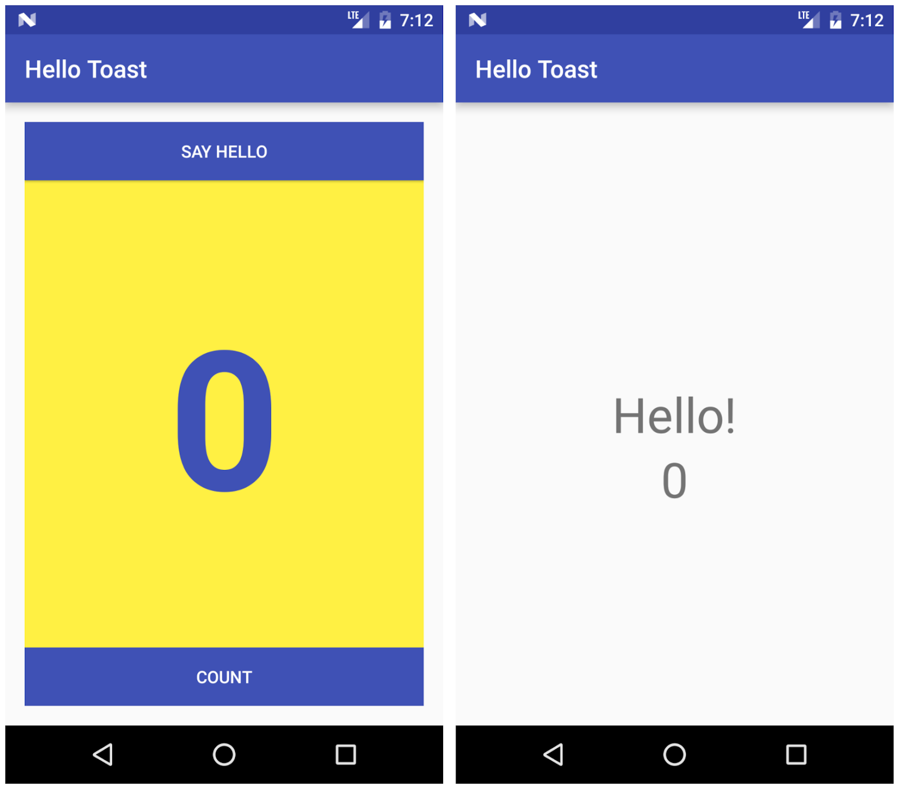

# Travail à faire (Compte Rendu)

> [!WARNING]  
> Veuillez suivre les instructions détaillées du codelab **[Comment soumettre votre compte rendu](https://codelabs-enetcom.khammami.tn/codelabs/soumettre-compte-rendu/)** pour soumettre votre compte rendu.

## Créer et exécuter une application

Ouvrez l'application HelloToast que vous avez créée dans une pratique antérieure.

1. Modifiez le bouton **Toast** pour qu'il lance une nouvelle activité et affiche le mot **"Hello!"** et le nombre actuel, comme indiqué ci-dessous.
2. Modifiez le texte sur le bouton `Toast` en **Say Hello**.

## Répondre à ces questions

### **Question 1**

**Q1.** Quelles modifications sont apportées lorsque vous ajoutez une deuxième activité à votre application en choisissant **File > New > Activity** et un modèle d'activité?:

📋 **A1.** Choisissez-en un:

* [ ] **(a)** La deuxième activité est ajoutée en tant que classe Java. Vous devez toujours ajouter le fichier de mise en page (layout) XML.
* [ ] **(b)** Le deuxième fichier de mise en page XML d'activité est créé et une classe Java ajoutée. Vous devez toujours définir la signature de la classe.
* [ ] **(c)** La deuxième activité est ajoutée en tant que classe Java, le fichier de présentation (layout) XML est créé et le fichier `AndroidManifest.xml` est modifié pour déclarer une deuxième activité.
* [ ] **(d)** Le deuxième fichier de présentation (layout) XML d'activité est créé et le fichier `AndroidManifest.xml` est modifié pour déclarer une deuxième activité.

### **Question 2**

**Q2.** Que se passe-t-il si vous supprimez les éléments `android:parentActivityName` et `<meta-data>` de la deuxième déclaration d'activité du fichier `AndroidManifest.xml`?:

📋 **A2.** Choisissez-en un:

* [ ] **(a)** La deuxième activité n'apparaît plus lorsque vous essayez de la démarrer avec une intention (`Intent`) explicite.
* [ ] **(b)** Le deuxième fichier de mise en page (layout) XML d'activité est supprimé.
* [ ] **(c)** Le bouton Back (Précédent) ne fonctionne plus dans la deuxième activité pour renvoyer l'utilisateur à l'activité principale.
* [ ] **(d)** Le bouton Up (Haut) de la barre d'applications n'apparaît plus dans la deuxième activité pour renvoyer l'utilisateur à l'activité parent.

### **Question 3**

**Q3.** Quelle méthode de constructeur utilisez-vous pour créer une nouvelle intention (`Intent`) explicite?:

📋 **A3.** Choisissez-en un:

* [ ] **(a)** `new Intent()`
* [ ] **(b)** `new Intent(Context context, Class<?> class)`
* [ ] **(c)** `new Intent(String action, Uri uri)`
* [ ] **(d)** `new Intent(String action)`

### **Question 4**

**Q4.** Dans l'application HelloToast (du Travail à faire), comment ajoutez-vous la valeur actuelle du comptage à l'intention (`Intent`)?:

📋 **A4.** Choisissez-en un:

* [ ] **(a)** Comme les données d'intention (`Intent`)
* [ ] **(b)** Comme `TEXT_REQUEST` de l'intention (`Intent`)
* [ ] **(c)** En tant qu'action d'intention (`Intent`)
* [ ] **(d)** Comme extra d'intention (`Intent`)

### **Question 5**

**Q5.** Dans l'application HelloToast (du Travail à faire), comment afficher le nombre actuel dans la deuxième activité "Hello"?:

📋 **A5.** Choisissez-en un:

* [ ] **(a)** Obtenez l'intention (`Intent`) avec laquelle l'activité a été lancée.
* [ ] **(b)** Obtenez la valeur actuelle du comptage de l'intention.
* [ ] **(c)** Mettez à jour le `TextView` pour le comptage.
* [ ] **(d)** Tout ce qui précède.

## Notes

> [!NOTE]  
>
> Vérifiez que l'application dispose des éléments suivants:
>
> * Il affiche le bouton **Say Hello** au lieu du bouton **Toast**.
> * La deuxième activité commence lorsque le bouton **Say Hello** est enfoncé et affiche le message **"Hello!"** et le nombre actuel de `MainActivity`.
> * Les fichiers de présentation (layout) XML et Java de la deuxième Activité ont été ajoutés au projet.
> * Le fichier de présentation (layout) XML de la deuxième activité contient deux éléments `TextView`, l'un avec la chaîne **"Hello!"** et le second avec le compte.
> * Il inclut une implémentation d'une méthode de gestion des clics pour le bouton **Say Hello** (dans `MainActivity`).
> * Il inclut une implémentation de la méthode `onCreate()` pour la deuxième activité et met à jour le décompte `TextView` avec le décompte de `MainActivity`.
